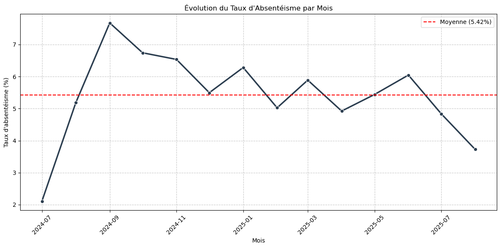
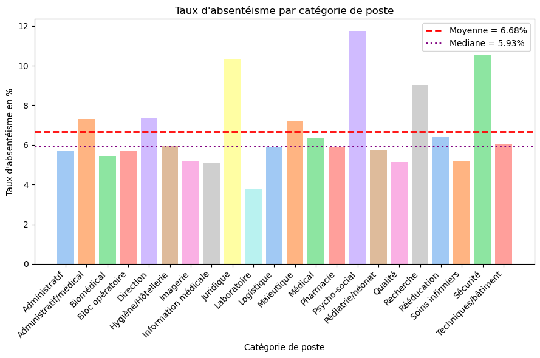
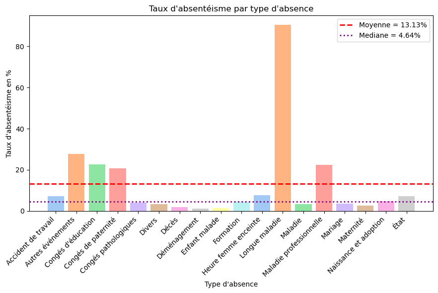
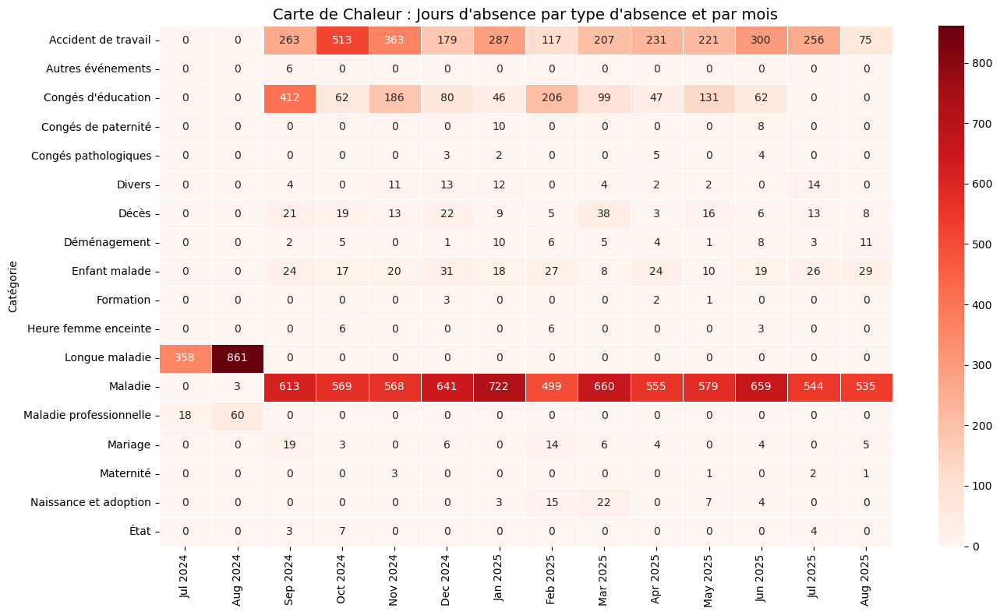
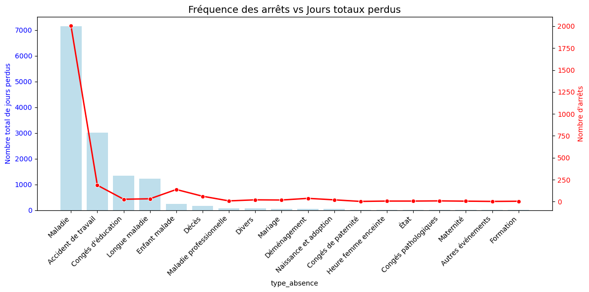

# Employee Absenteeism Analysis

> **Master 1 — Applied Mathematics, Statistics: Data Science**  
> Aix-Marseille University · 2025–2026

Analysis of employee absenteeism using Python, with a focus on data preparation, KPI construction, temporal analysis, and data visualization.

---

## Overview

This project explores employee absenteeism data to identify patterns and understand the main factors associated with lost working days.

The analysis covers a dataset of **2,586 absence records** over a **14-month period**, from July 2024 to August 2025.

The objective is to study absenteeism from several perspectives:

- Overall absenteeism rate
- Evolution over time
- Absence types and their impact
- Contract types
- Job categories
- Employee age
- Frequency of absences versus total days lost

---

## Objectives

The main questions addressed in this analysis are:

- How does the absenteeism rate evolve over time?
- Which absence types are the most frequent?
- Which types of absence have the greatest impact in terms of lost working days?
- How does absenteeism vary across contract types and job categories?
- Are some absence patterns associated with employee age?
- How can the number of employees in each job category affect the interpretation of absenteeism rates?

---

## Methodology

### 1. Data preparation

The analysis is based on an enriched dataset containing information about:

- Absence dates and duration
- Absence types and categories
- Contract types
- Job categories
- Employee information
- Employee age

Dates were converted to datetime format and additional temporal features were created, including month and year.

### 2. KPI construction

The overall absenteeism rate was calculated as:

$$
\text{Absenteeism Rate} =
\frac{\text{Total Absence Days}}
{\text{Total Working Days}}
\times 100
$$

The analysis assumes an average of **21.75 working days per month**.

The resulting overall absenteeism rate is approximately **5.42%** over the study period.

### 3. Exploratory analysis

Several analyses were performed to compare absenteeism across:

- Time periods
- Absence types
- Contract types
- Job categories
- Employee age

Additional cross-tabulations and heatmaps were used to study interactions between absence types, job categories, and months.

---

## Key Findings

### Overall absenteeism

The overall absenteeism rate is approximately **5.42%** over the study period.

The monthly rate varies considerably, with the highest rate observed in **September 2024 (7.67%)** and the lowest in **July 2024 (2.11%)**.

### Absence types

Sick leave is the most frequent type of absence and also represents the largest number of lost working days.

Long-term illness is much less frequent but has a substantially larger impact in terms of absence duration.

This highlights the importance of distinguishing between **frequency** and **duration** when analyzing absenteeism.

### Job categories

Absenteeism rates vary considerably across job categories.

The highest rates are observed in the **Psychosocial, Security, and Legal** categories, while the **Laboratory** category has the lowest rate.

However, these rates must be interpreted alongside the size of each category. For example, the Legal category contains only two employees, whereas Nursing Care contains 260 employees.

This illustrates why raw absence counts and normalized absenteeism rates should be considered together.

### Temporal patterns

September 2024 shows a notable peak in absenteeism.

A more detailed analysis of September shows that **sick leave, educational leave, and workplace accidents** account for most of the absence days during that month.

---

## Visualizations

### Absenteeism rate over time



The monthly absenteeism rate highlights variations throughout the study period and the peak observed in September 2024.

### Absenteeism by job category



Comparison of absenteeism rates across different job categories.

### Absenteeism by absence type



Comparison of absenteeism rates according to the type of absence.

### Absence days by type and month



Heatmap showing how absence days are distributed across absence types and months.

### Frequency vs. total days lost



Comparison between the number of absence events and the total number of working days lost for each absence type.

---

## Technologies

- **Python**
- **Pandas** — data manipulation and aggregation
- **NumPy** — numerical computations
- **Matplotlib** — data visualization
- **Seaborn** — statistical visualization
- **Jupyter Notebook** — analysis and experimentation

---

## Project Structure

```text
employee-absenteeism-analysis/
│
├── README.md
│
├── data/
│   ├── absences.csv
│   ├── absences_enrichies.csv
│   ├── absences_types.csv
│   ├── conges_rtt.csv
│   ├── contrats.csv
│   └── personnes.csv
│
├── figures/
│   ├── absenteisme_absence.png
│   ├── absenteisme_poste.png
│   ├── evol_taux_abs.png
│   ├── freq_Arret_j_perdu.png
│   └── heatmap_j_abs_type_abs_mois.png
│
└── notebook/
    └── absenteeism_analysis.ipynb
```

---

## Key Takeaways

The analysis highlights that employee absenteeism should be assessed through multiple complementary indicators rather than a single measure.

- **Frequency and duration** provide different insights: sick leave is the most frequent type of absence, while long-term illness is less frequent but has a much greater impact in terms of days lost.
- **Time patterns** reveal significant variations in absenteeism, including a notable peak in September 2024.
- **Job category and workforce size** must be considered together when interpreting absenteeism rates, as small groups can produce disproportionately high rates.

Overall, combining absenteeism rates, absence frequency, duration, and workforce size provides a more accurate understanding of absenteeism patterns.

---

## Author

**Imen Miloudi**  
*M1 Applied Mathematics, Statistics — Data Science*  
Aix-Marseille University · 2025–2026
